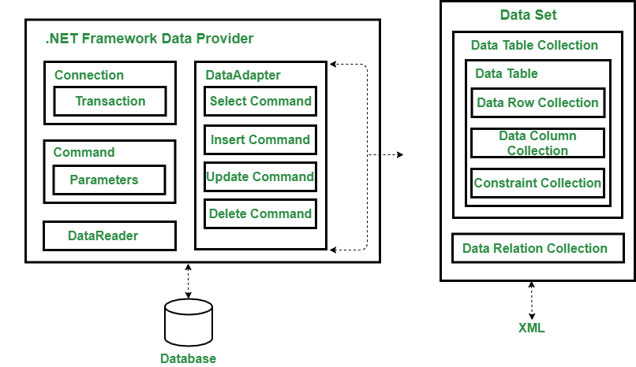

# Practical No.3
<br/>
<u><i>Datasource and the Connection Grid To be Separated in the Files</i></u>

## Data Bound Control / Data Binding Control (Grid View) 
<br/>

> <a href ="#">Data Source and Data Bound Control </a>
<br/>

> # ADO.net :Active X Data Objects is rich set of classes internet <br/>

> "using" is Keyword to import data <br/>

> 1. <b>Connected Archietecture:</b> Stay Connected while Accessing data with Connection string and retrive data from it. It contain SqlCommand,SqlDataReader,SqlConnection. SqlDataReader contain only single data and it Faster performance<br/>

> 2. <b>Disconnected Arichietecture:</b> When required you connected to the database. It contain temporary database work on the temporary db after it update to the Main db. It contain SqlConnection, DataSet, SqlDataAdapter,SqlCommandBuilder. DataSet is Slower and contain multiple type data. SqlDataAdapter CRUD operation work on it. DataSet allow multiple table takes time. SqlCommondBuilder is used to build Command ar requirements, It will Automatically create Sql Query. fill() retrive data from Main to temporary table, update() add updated data from temporay data to main data.<br/>


</img>

class change with files name and connection file.

> SqlConnection: to connect with the DB using Open() method and Close().<br/>
> SqlConnection conn;<br/>
> conn.Open(); <br/>

> SqlCommand: Execute use various interactions based on the requirements <br/>
> 1. ExecuteScaler(): Single cell operations to be perform by using it.(e.g. Select, Update, sum(), min(), max() )<br/>
> 2. ExecuteReader(): When it executes returns an Instance of <b>DataReader</b> Class.<br/>
> 3. ExecuteNonQuery(): It returns (DML integer) how many data or rows are affected.(Update, Insert).<br/>
> 4. DataReader Object: You can Read Only the Data. Results of Connected Architecture. <b>It display Single Table inside of it</b>. Faster Access, Manually Control.We Can't create relation in data reader.It Can't modify data.

``` C#
  protected void btnSort_Click(object sender, EventArgs e)
        {
            try
            {
                DataView dv = new DataView(dt);
               // dv.Sort = TextBox4.Text; // name ASC
                dv.RowFilter = TextBox4.Text; //"address =Mumbai"
                GridView1.DataSource = dv;
                GridView1.DataBind();
            }catch(Exception ex)
            {
                Label5.Text = "Exception" + ex.Message;
               
            }
        }

        protected void btnAddSP_Click(object sender, EventArgs e)
        {

            try
            {

                if (txtRollno.Text != "" && txtName.Text != "" && txtAddress.Text != "")
                {
                    cmd = new SqlCommand();
                    if (conn.State == ConnectionState.Closed)
                    {
                        conn.Open();
                    }
                    cmd.Connection = conn;
                    cmd.CommandType = CommandType.StoredProcedure;
                    cmd.CommandText = "insertData";

                    cmd.Parameters.Add(new SqlParameter("@RollNo", SqlDbType.SmallInt)).Value =
                        Convert.ToInt16(txtRollno.Text);


                    cmd.Parameters.Add(new SqlParameter("@Name", SqlDbType.VarChar)).Value =
                        txtName.Text;

                    cmd.Parameters.Add(new SqlParameter("@Address", SqlDbType.VarChar)).Value =
                        txtAddress.Text;


                    int r = cmd.ExecuteNonQuery();

                    if (r != 0)
                    {
                        TextBox4.Text = "Record Inserted";
                    }
                    else
                    {
                        TextBox4.Text = "Failed!!";
                    }


                }
                else
                {
                    Label5.Text = "Please Enter Data!";
                }
            }
            catch (Exception ex)
            {
                Label5.Text = "Exception" + ex.Message;
            }
            finally
            {
                conn.Close();
                showData();

            }

        }

        protected void btnSrcSP_Click(object sender, EventArgs e)
        {

            try
            {

                if (TextBox4.Text != "")
                {
                    cmd = new SqlCommand();
                    if (conn.State == ConnectionState.Closed)
                    {
                        conn.Open();
                    }
                    cmd.Connection = conn;
                    cmd.CommandType = CommandType.StoredProcedure;
                    cmd.CommandText = "srcData";


                    cmd.Parameters.Add(new SqlParameter("@RollNo", SqlDbType.SmallInt)).Value =
                        Convert.ToInt16(TextBox4.Text);
                    dr = cmd.ExecuteReader();
                    if (dr.HasRows)
                    {
                        Label5.Text = "Got The Records ";


                        while (dr.Read())
                        {


                            txtRollno.Text = dr[0].ToString();
                            txtName.Text = dr[1].ToString();
                            txtAddress.Text = dr[2].ToString();
                        }
                    }
                    else
                    {
                        Label5.Text = ("Records Not Found");
                    }
                }
                else
                {
                    Label5.Text = "Please Enter Data!";
                }
            }
            catch (Exception ex)
            {
                Label5.Text = "Exception" + ex.Message;
            }
            finally
            {
                conn.Close();

            }
        }

        protected void btnDltSP_Click(object sender, EventArgs e)
        {

            try
            {

                if (txtRollno.Text != "")
                {
                    cmd = new SqlCommand();
                    if (conn.State == ConnectionState.Closed)
                    {
                        conn.Open();
                    }
                    cmd.Connection = conn;
                    cmd.CommandType = CommandType.StoredProcedure;
                    cmd.CommandText = "deleteData";


                    cmd.Parameters.Add(new SqlParameter("@RollNo", SqlDbType.SmallInt)).Value =
                        Convert.ToInt16(txtRollno.Text);


                    int r = cmd.ExecuteNonQuery();

                    if (r != 0)
                    {
                        TextBox4.Text = "Record Deleted";
                    }
                    else
                    {
                        TextBox4.Text = "Failed!!";
                    }


                }
                else
                {
                    Label5.Text = "Please Enter Data!";
                }
            }
            catch (Exception ex)
            {
                Label5.Text = "Exception" + ex.Message;
            }
            finally
            {
                conn.Close();
                showData();

            }
        }

        protected void btnUpdateSP_Click(object sender, EventArgs e)
        {

            try
            {

                if (txtRollno.Text != "" && txtName.Text != "" && txtAddress.Text != "")
                {
                    cmd = new SqlCommand();
                    if (conn.State == ConnectionState.Closed)
                    {
                        conn.Open();
                    }
                    cmd.Connection = conn;
                    cmd.CommandType = CommandType.StoredProcedure;
                    cmd.CommandText = "updateData";

                    cmd.Parameters.Add(new SqlParameter("@RollNo", SqlDbType.SmallInt)).Value =
                        Convert.ToInt16(txtRollno.Text);


                    cmd.Parameters.Add(new SqlParameter("@Name", SqlDbType.VarChar)).Value =
                        txtName.Text;

                    cmd.Parameters.Add(new SqlParameter("@Address", SqlDbType.VarChar)).Value =
                        txtAddress.Text;

                    int r = cmd.ExecuteNonQuery();

                    if (r != 0)
                    {
                        TextBox4.Text = "Record Updated";
                    }
                    else
                    {
                        TextBox4.Text = "Failed!!";
                    }


                }
                else
                {
                    Label5.Text = "Please Enter Data!";
                }
            }
            catch (Exception ex)
            {
                Label5.Text = "Exception" + ex.Message;
            }
            finally
            {
                conn.Close();
                showData();

            }

        }
```
# SQL Stored Procedures Below:

``` Sql Stored Procedure
#1
CREATE PROCEDURE insertData
(@RollNo int,
@Name varchar(50),
@Address varchar(50))
AS
begin 
insert into stud values(@RollNo,@Name,@Address)
SET NOCOUNT ON;
end

#2
CREATE PROCEDURE deleteData
(@RollNo int)
AS
begin 
DELETE stud WHERE rollno=@RollNo
SET NOCOUNT ON;
end

#3
CREATE PROCEDURE selectData
(@Rollno int)
AS
BEGIN
SELECT * FROM stud WHERE rollno=@Rollno;
SET NOCOUNT ON;
END
GO

#4
CREATE PROCEDURE updateData
(@RollNo int,
@Name varchar(50),
@Address varchar(50))
AS
begin 
UPDATE stud SET name=@Name,address=@Address WHERE rollno=@RollNo
SET NOCOUNT ON;
end
```
